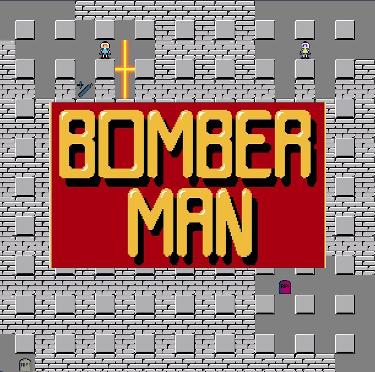

# 🧨 Bomberman Online (Multiplayer)



A real-time multiplayer clone of the classic **Bomberman** built with **Vue 3**, **Pinia**, and **Socket.IO** on a **Node.js**.  
Players can move around, drop bombs, trigger explosions, and get eliminated — all synced across clients.

---

## Features
- **Multiplayer** gameplay via WebSockets (`socket.io`).
- Multiple player characters with unique sprites.
- Place bombs, create chain explosions, destroy tiles and collect power ups.
- Sound effects and classic Bomberman tracks.
- Lobby system to join and start games.

---

## Tech Stack
- **Frontend**: Vue 3, Vite, Pinia, NES.css (https://nostalgic-css.github.io/NES.css) 
- **Backend**: Node.js, Socket.IO  
- **Animations**: CSS sprite animations + Aseprite sprites 

---

## Getting Started

### 1. Clone the repository
```bash
git clone https://github.com/Tykion/web-bomberman-game
cd web-game
```

### 2. Install dependencies and run the program
All together
```bash
  #Main root (web-game)
npm install
npm run bomb-me
```
Frontend
```bash
cd client
npm install
npm run dev
```
Backend
```bash
cd server
npm install
node app.js
```

## How to play
1. Open the frontend in your browser (preferably firefox)
2. Enter/Create a lobby and start the game
3. Move your bomberman around the map:
    * Arrow keys -> Move
    * Space -> Drop bomb
4. Break tiles and collect powerups
5. Avoid explosions and survive!

